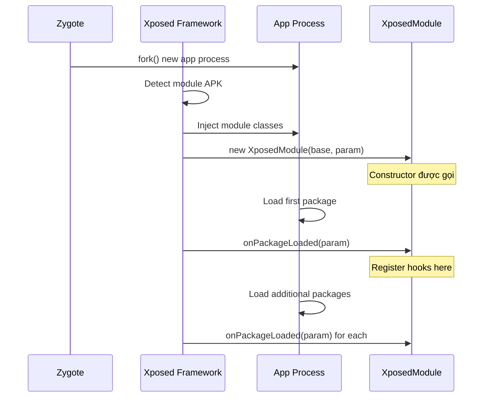
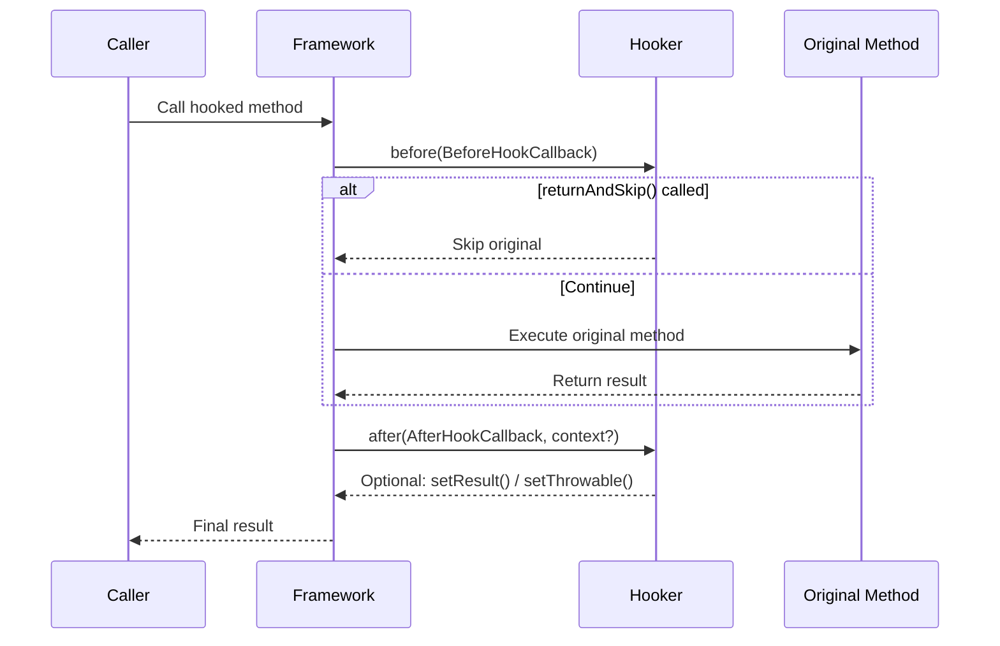
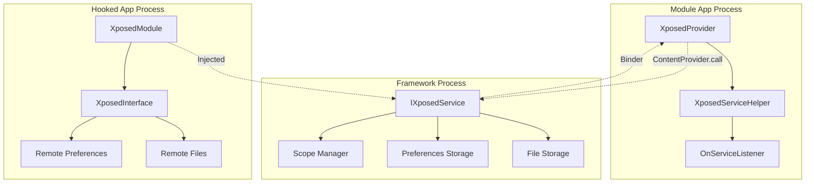
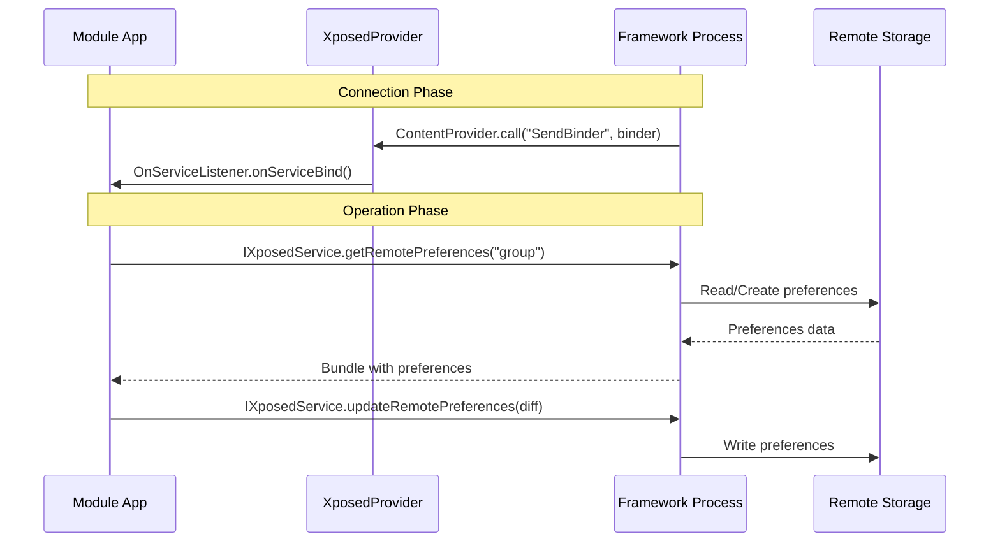
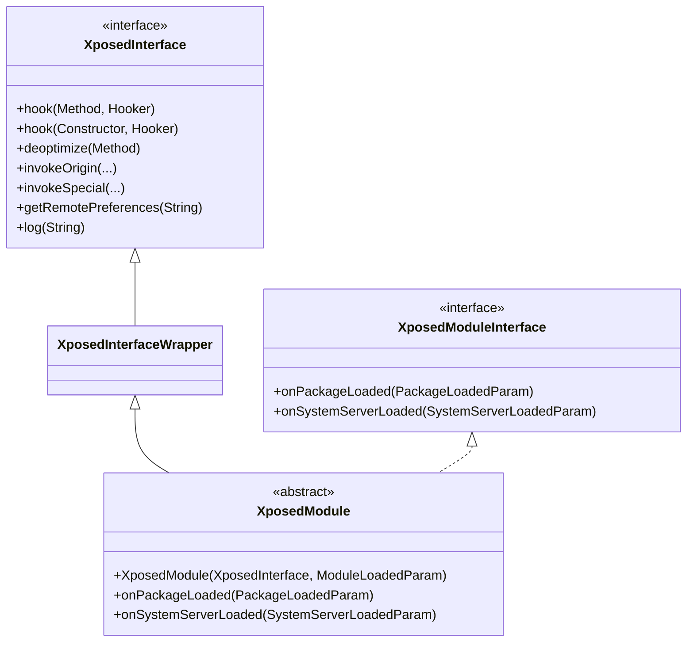

# LibXposed Architecture

## Module Loading Flow



## Hook Execution Flow



## IPC Architecture



## IPC Connection Flow



## Class Hierarchy



## Privilege Levels

| Level | Value | Description | IPC Support |
|-------|-------|-------------|-------------|
| ROOT | 0 | Framework chạy với root | ✅ Full |
| CONTAINER | 1 | Container với fake system_server | ✅ Full |
| APP | 2 | Framework chạy như app | ✅ Limited |
| EMBEDDED | 3 | Framework embedded trong app | ❌ None |

## Data Flow

### Write Preferences (Module App)

```
Module App → XposedService.getRemotePreferences()
           → SharedPreferences.Editor.putXxx()
           → SharedPreferences.Editor.apply()
           → IXposedService.updateRemotePreferences()
           → Framework Storage
```

### Read Preferences (Hooked Process)

```
Hooked Process → XposedInterface.getRemotePreferences()
               → Framework Storage (via Binder)
               → SharedPreferences (read-only)
```

## AndroidManifest Requirements

```xml
<!-- XposedProvider for IPC -->
<provider
    android:name="io.github.libxposed.service.XposedProvider"
    android:authorities="${applicationId}.XposedService"
    android:exported="true" />

<!-- Module metadata -->
<meta-data
    android:name="xposedmodule"
    android:value="true" />
<meta-data
    android:name="xposedminversion"
    android:value="100" />
```

## xposed_init File

Khai báo entry class trong `assets/xposed_init`:

```
com.example.module.MainHook
```
